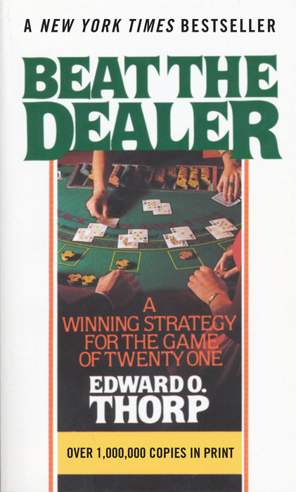

# Beat the Dealer: A Winning Strategy for the Game of Twenty-One
## By  Edward O. Thorp

| Author | Edward O. Thorp |
| --- | --- |
| ISBN | 0-394-70310-3 |
| Published | 1962 |
| Amazon | [Beat the Dealer](https://www.amazon.com/Beat-Dealer-Winning-Strategy-Twenty-One/dp/0394703103/) |

Beat the Dealer was the first book that exposed the exploitable nature of Blackjack and introduced the world to card counting.
