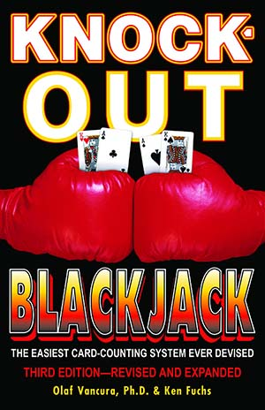

# Knock-Out Count
## The Unbalanced Knock-Out System

The Knock-Out Counting System (a.k.a. the Unbalanced Knock-Out System or the KO Count)

| Attribute             | Value                             |
| ---                   | :-:                               |
| Balanced Count        | N                                 |
| Side Counts           | N                                 |
| True Count Divisor    | No True Count conversion needed   |
| Take Insurance at     | +3 running count                  |

# Card Values

| Card  | 2   | 3   | 4   | 5   | 6   | 7   | 8   | 9   | T   | A   |
| ---   | --- | --- | --- | --- | --- | --- | --- | --- | --- | --- |
| Value | +1  | +1  | +1  | +1  | +1  | +1  | 0   | 0   | -1  | -1  |

# As Seen In
[Knock-Out Blackjack](../../Books/Knock-Out%20Blackjack/)

