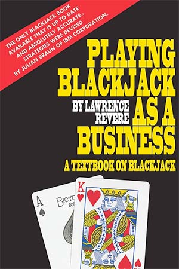

# Revere Point Count

The Revere Point Count is a level 2 counting systems from the book Playing Blackjack as a Business.

| Attribute             | Value         |
| ---                   | :-:           |
| Balanced Count        | Y             |
| Side Counts           | Y (Aces)      |
| True Count Divisor    | 1 Deck        |
| Take Insurance at     | +2 TC if no surplus of Aces |

# Card Values

| Card  | 2   | 3   | 4   | 5   | 6   | 7   | 8   | 9   | T   | A   |
| ---   | --- | --- | --- | --- | --- | --- | --- | --- | --- | --- |
| Value | +1  | +2  | +2  | +2  | +2  | +1  | 0   | 0   | -2  | -2  |

# As Seen In
[Playing Blackjack as a Business](../../Books/Playing%20Blackjack%20as%20a%20Business/)

