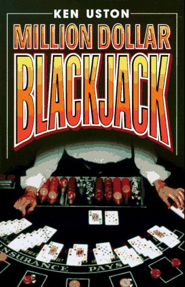

# Uston Advanced Point Count

The Uston Advanced Point Count (Uston APC) is one of the most complex counting systems out there. The card
values range from -3 to +3, and it requires a side count of Aces

| Attribute             | Value         |
| ---                   | :-:           |
| Balanced Count        | Y             |
| Side Counts           | Yes - Aces    |
| True Count Divisor    | 1/2 Deck      |
| Take Insurance at     | +3 True Count |

# Card Values

| Card  | 2   | 3   | 4   | 5   | 6   | 7   | 8   | 9   | T   | A   |
| ---   | --- | --- | --- | --- | --- | --- | --- | --- | --- | --- |
| Value | +1  | +2  | +2  | +3  | +2  | +2  | +1  | -1  | -3  | 0 (Side count) |

# As Seen In
[Million Dollar Blackjack](../../Books/Million%20Dollar%20Blackjack/)

